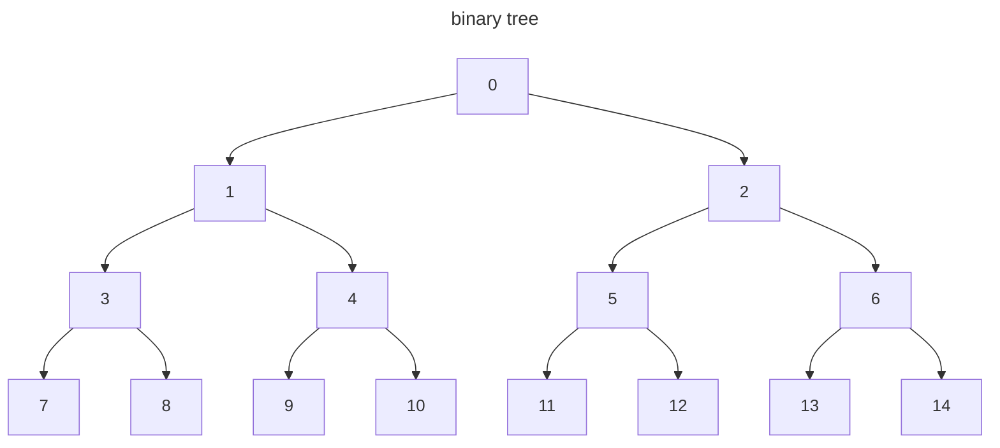
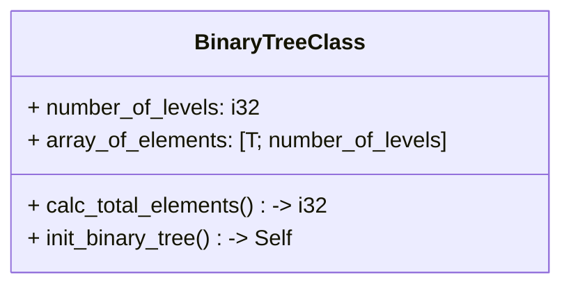

```yaml
title: Algorithmics
subtitle: DLMCSA01
authors: Prof. Dr. Cosmina Croitoru
publisher: IU International University of Applied Sciences
date: 2023
```

# Algorithm Design

pp. 34-70

Our learning objectives are as follows:
+ How to organize the data of your algorithms into suitable data structures.
+ The user of iteration and recursion in algorithm design.
+ Key algorithm design strategies.

## Introduction

You will eventually need to create an algorithm for a computational problem in the field of computer science. It is handy to know of existing algorithm design techniques to draw inspiration from. It's also important to have experience with other computational problems to find similarities and differences between various computational problems. Because some differences come from the nature of the underlying data, an understanding of different data structures is also critical in design. 

## 2.1 Data Structures

pp. 34-59

As stated above, algorithms use different data structures, which may represent different data. What is a data structure? A **Data Structure** organizes data into a suitable format that allows an algorithm to apply operations to it. Examples include arrays, lists, heaps, queues, stacks, trees, and graphs. 

### Arrays

We said an array is an example of a data structure, but what is it? You can read up on [array (data structure) | wiki](https://en.wikipedia.org/wiki/Array_(data_structure)) for more information. But, an **Array** is a finite collection of elements, each taking up the same amount of space in memory and identified by at least one array index, or key. 

We say the length of an array is equal to the "length of its sequence of elements". Elements are accessible through their indices. Arrays can allow for insertion and removal of elements in or from any position in the array. 

Note, arrays do not grow in size. If you push an additional element into an array then the program allocates a new amount of memory to transfer the information. Here's a quick example of the [Primitive Type Array](https://doc.rust-lang.org/std/primitive.array.html) in Rust. 

```rust
fn swap(vals: &mut [i32], i1: usize, i2: usize) {
    let tmp: i32 = vals[i1];
    vals[i1] = vals[i2];
    vals[i2] = tmp;
}

fn main() {
    println!("Arrays in Rust");
    let ar: [i32; 5] = [1,2,3,4,5];
    dbg!(&ar);
    dbg!(&ar[3]);
    // ar[3] = 42; // panic!("cannot assign to immutable variable");
    let mut foo: [&str; 2] = ["Hello,", " bar"];
    dbg!(&foo);
    foo[1] = " world!";
    dbg!(&foo);
    let bar = foo.clone();
    dbg!(bar);
    
    let mut ar2: [i32; 4] = [42, 0, 0, 69];
    swap(&mut ar2, 0, 3);
    assert_eq!([69, 0, 0, 42], ar2);
}
```

The course book uses JavaScript for arrays. This is a dynamically typed language with dynamically sized arrays. In Rust, you should specify the types held in the array and the number of elements so the compiler can adequately allocated enough memory to store the data. 

Note, nearly everything in JavaScript is really an object, or at least treated as such ([arrays included]([Array - JavaScript | MDN (mozilla.org)](https://developer.mozilla.org/en-US/docs/Web/JavaScript/Reference/Global_Objects/Array))). An array in JS does not have contiguous memory allocation optimizations that traditional arrays do. They are actually more like hashes, where perhaps some additional memory is allocated to account for some pushing. This allows for **sparse arrays**, where not every element needs to contain data. The array being more like an object has advantages though with the many different built-in methods you can use to manipulate memory. 

### Stacks

In <span style="text-decoration: underline;">Introduction to Algorithms</span> 4th edition, by Thomas Cormen and company, an MIT Press book, page 254 starts a lovely discussion about stacks and queues. A **stack** is a data structure of a sequence of elements where new new elements are only inserted at the end of the sequence, and only the elements at the same end are removed. 

When you add an elements, we call that `push()`, and removing an element is called `pop()`. In Rust, the `Vec` struct, short for "vector", is pretty much already an array based stack with `push()` and `pop()` methods, and many more. You could try to implement your own light-weight version of an array stack, probably have to use the `Option` struct to fill the array initially. 

Additionally, a stack can bleed into the topic of a list. First, to create a list we need nodes that point to each other. This is simple in JavaScript but challenging in Rust. [Understanding pointers in Rust | StackOverflow](https://stackoverflow.com/questions/31949579/understanding-and-relationship-between-box-ref-and) is a good look into pointers. It is good to cover though that in Rust, a reference, denoted with `&` is more for just borrowing data and the smart pointers actually own the data. 

```rust
#[derive(Debug, PartialEq, PartialOrd, Clone)]
pub struct DataNode<T> {
    value: T,
    previous_node: Option<Box<DataNode<T>>>,
}

#[derive(Debug, PartialEq, PartialOrd)]
pub struct Stack<T> {
    top: Option<Box<DataNode<T>>>,
}

impl<T> Stack<T> {
    pub fn new() -> Self {
        Stack { top: None }
    }
    pub fn push(&mut self, val: T) {
        let mut new_node: DataNode<T> = DataNode {
            value: val,
            previous_node: None,
        };

        match self.top.take() {
            Some(s) => {
                new_node.previous_node = Some(Box::new(*s));
                self.top = Some(Box::new(new_node));
            }
            None => {
                self.top = Some(Box::new(new_node));
            }
        }
    }
    pub fn pop(&mut self) -> Option<T> {
        // self.top will now be None
        let mut tippy_top = self.top.take();
        match tippy_top {
            None => {
                self.top = None;
                return None;
            }
            Some(box_data) => {
                // return tippytop value and store it's prev_node as Stack
                let mut raw_data: DataNode<T> = *box_data;
                self.top = raw_data.previous_node.take();
                return Some(raw_data.value);
            }
        }
    }
}

#[cfg(test)]
mod tests {
    use super::*;

    #[test]
    fn test_make_stack() {
        let actual: Stack<i8> = Stack::new();
        let excpected: Stack<i8> = Stack { top: None };
        assert!(actual == excpected);
    }
    #[test]
    fn test_push_to_stack() {
        let obj1: DataNode<i32> = DataNode {
            value: 69,
            previous_node: None,
        };
        let obj2: DataNode<i32> = DataNode {
            value: 42,
            previous_node: Some(Box::new(obj1)),
        };
        let expected: Stack<i32> = Stack {
            top: Some(Box::new(obj2)),
        };
        let mut actual: Stack<i32> = Stack::new();
        actual.push(69);
        actual.push(42);
        assert_eq!(actual, expected);
    }
    #[test]
    fn test_pop_from_stack() {
        // test value poped and stack after
        let obj1: DataNode<i32> = DataNode {
            value: 69,
            previous_node: None,
        };
        let obj2: DataNode<i32> = DataNode {
            value: 42,
            previous_node: Some(Box::new(obj1.clone())),
        };
        let mut actual_stack: Stack<i32> = Stack {
            top: Some(Box::new(obj2)),
        };
        let actual_value: Option<i32> = actual_stack.pop();
        let expected_value: Option<i32> = Some(42);
        let expected_stack: Stack<i32> = Stack {
            top: Some(Box::new(obj1.clone())),
        };
        assert_eq!(actual_value, expected_value);
        assert_eq!(actual_stack, expected_stack);
    }
```

This is my implementation of linked-list Stack in Rust. It took a minute to make, and I learned about the `Option.take()` method. It's an option wrapper for the [`std::mem` | rust-lang.org](https://doc.rust-lang.org/std/mem/index.html) crate. 

You may also want to implement methods or features to iterate through the list, view particular points without popping values, and maybe track the length. 

### Lists

Section 10.2, starting on page 258 of MIT's <span style="text-decoration: underline">Introduction to Algorithms</span>, begins the discussion of linked lists. A **Linked List** is a data structure where objects are arranged in a linear order, so one after another. It's a sequence of elements, much like an array or a stack. The Course Book says you always want to know the current position of the _cursor_ of the list. 

An array stores objects in a contiguous chunk of memory and the linear order is determined by the array indices. The order in a linked list is determined by a pointer in each object. A linked list should support typical operations such as:
+ `Search()`, returning a pointer to the value looking for or `Nil`.
+ `Insert()`,
+ `Delete()`
+ `Minimum()` and `Maximum()`
+ `Successor()`, for an ordered set, you would give a key and receive a pointer to the next larger element in the set.
+ `Predecessor()`, opposite of the former. 

The Course Book sounds to be considering a doubly linked list, where you point to the next and previous elements; but no, it's mainly like a stack but it travels up the list to the "cursor". A **Cursor** is the unique current position in a list, like which element we are focusing on currently. Maybe you stored a reference to it as a variable. For a Stack, the cursor always points to the top of the Stack; therefore, all operations can only apply to the top of the stack. 

Lists offer the possibility to change the value of the position of their cursor. The Course Book suggests that lists can easily be implement by a class with an _array_ as a private attribute in JavaScript. Rust could have a struct with a _vector_, which is like the dynamically sized array in JavaScript. When considering space and time complexity there are trade-offs between using dynamic arrays and linked lists. Consider inserting with an array. If you insert a node at the beginning instead of the end, then you shift everything down one memory address. That can be a lot of work. For a list, you just save the pointer on an existing node. However, try iterating through a linked list and the CPU will try pulling data from seemingly random places in memory, which can be a lot of work. 

The Couse Book provides a JavaScript implementation of a linked list, or a list with linked nodes as they say. It also has methods on the list for getting, removing and displaying elements at a cursor, and inserting elements.

> Insert List example here

### Non-Priority and Priority Queues

Starting on page 256 of <span style="text-decoration: underline">Introduction to Algorithms</span>, we look at the Queue data structure. Similar to a Stack, but the stack is _Last in First Out_ (LIFO), and a queue is _First in First Out_ (FIFO). This just means that the pop method removes the first element in the queue instead of the most recently applied. Also, the `insert()` operation should be called `enqueue()`, and the `delete()` or `pop()` method is called `dequeue()`. 

A queue has a _head_ and a _tail_. Elements are added to the tail and removed from the head. 

A **Priority Queue** is a data structure for maintaining a set of elements, each with an associated value called a **key**. A **Max-Priority Queue** would support the following operations:
+ `Insert(S, x, k)` inserts element `x` with key `k` into set `S`. 
+ `Maximum()` returns element with largest key.
+ `Extract-Max()` removes and returns the element with largest key.
+ `Increase_Key(S, x, k)` increases value of `x`'s key to `k`, apparently assumed to be at least as larges as the current key's value. 
	+ So no decreasing?

This would be good for a job scheduler on a computer to run the most important jobs first. 

There's also a **Min-Priority Queue** supporting the following operations:
+ `Insert(S, x, k)` inserts element `x` with key `k` into set `S`. 
+ `Minimum()` returns element with smallest key.
+ `Extract-Min()` removes and returns the element with smallest key.
+ `Decrease_Key(S, x, k)` decreases value of `x`'s key to `k`, apparently assumed to be at least as small as the current key's value. 
	+ So no increasing?

This is good for an _event-driven simulator_. If the elements are representations of events and they must be simulated in order of their time of occurrence, the key can be the time value. 

Then, the **non-priority queue** runs strictly on a first in first out basis. I think this is slightly easier to implement and would be a better start of an example...

Trying to implement a linked-list non-priority queue in Rust is actually a huge pain... Stumbled across this [Learn Rust with Entirely Too Many Linked Lists](https://rust-unofficial.github.io/too-many-lists/) guide. Some languages don't care, but Rust cares about safety. Check out [Module std::cell | docs.rust-lang](https://doc.rust-lang.org/std/cell/index.html). You either have one mutable reference or several immutable references. We dive down a dark path of memory manipulation where we need the reference counter `Rc` struct and `RefCell` struct. 

I'm not saying this is t he best or even correct implementation at this point. But it works through a few tests. 

```rust
#[derive(Debug, Clone, PartialEq, PartialOrd)]
pub struct NonPriorityQueueNode<T> {
    pub value: T,
    pub next: Option<Rc<RefCell<NonPriorityQueueNode<T>>>>,
}

impl<T> NonPriorityQueueNode<T> {
    fn new(val: T) -> Self {
        Self {
            value: val,
            next: None,
        }
    }
}

#[derive(Debug, Clone, PartialEq, PartialOrd)]
pub struct NonPriorityQueue<T> {
    pub head: Option<Rc<RefCell<NonPriorityQueueNode<T>>>>,
    pub tail: Option<Rc<RefCell<NonPriorityQueueNode<T>>>>,
}

impl<'a, T> NonPriorityQueue<T>
where
    T: Clone,
{
    pub fn new() -> Self {
        NonPriorityQueue {
            head: None,
            tail: None,
        }
    }
    pub fn enqueue(&mut self, val: T) {
        let new_node = Rc::new(RefCell::new(NonPriorityQueueNode::new(val)));
        match self.tail.take() {
            None => {
                self.tail = Some(Rc::clone(&new_node));
                self.head = Some(Rc::clone(&new_node));
            }
            Some(ref_cnt) => {
                let mut end_elm: RefMut<'_, NonPriorityQueueNode<T>> = (*ref_cnt).borrow_mut();
                (*end_elm).next = Some(Rc::clone(&new_node));
                self.tail = Some(Rc::clone(&new_node));
            }
        }
    }
    pub fn dequeue(&mut self) -> Option<T> {
        match self.head.take() {
            None => {
                return None;
            }
            Some(old_head) => {
                self.head = (*old_head).borrow_mut().next.take();
                if let None = self.head {
                    self.tail = None;
                }
                let rv: T = (*old_head).borrow().value.clone();
                Some(rv)
            }
        }
    }
}
```

Basically, when you use the `tail` for a quicker execution of `enqueue()`, you will, at best, have multiple references. And you need a mutable reference to add another node to the tail. But that isn't allowed necessarily in Rust's memory model without going down unsafe code. The `RefCell` allows for inner mutability of immutable structures, and the `Rc` allows for multiple owners, or references. 

The Course Book states non-priority queues behave like lists with cursor positions always equal to zero. 

For a priority queue, it sounds like items are still put into a queue and there's a method like `get_priority_position()` to find the highest (or lowest) priority. A priority queue node structure would be similar to the non-priority queue node except it would have a `priority` attribute, or whatever you want to call it. So, the `enqueue()` would place elements/nodes on the back of the queue, and the `dequeue()` would remove the one with the highest priority. 

My other argument would be to place nodes in the list according to priority, and then pop them off as normal. On average, you wouldn't need to traverse the entire list as you would with the other method. 

### Binary Trees and Binary Search Trees

Appendix B.5 of <span style="text-decoration: underline">Introduction to Algorithms</span> starts a discussion on trees on page 1,169. It begins with the _free tree_, which resembles a mind map to me. Section B.5.2 beginning on page 1,171 discusses a _rooted tree_, which has a distinguished vertex we call the **root** node. This begins a hierarchy of nodes, where higher nodes (closer to root) are **ancestors** of lower nodes (further from root). And nodes further from root are **descendants** of nodes closer. 

You can look at a **subtree rooted at x** which is just pretending that some descendant `x` is the root of the tree and taking it from there. We also have all the other terms related to family from **parent** and **child** to **siblings** as well. 

finally, a node without children is a **leaf** (back to tree talk), or an **external node**. All other nodes are classified as **internal nodes**. If a node has $n$ children, is of **degree** $n$. We also have a concept of **depth**, which are nodes from root. And the **level** of a tree is a set of all nodes at a particular depth. We say the **height** is the greatest depth of a tree. And **ordered trees** is a rooted tree where its children of each node are ordered. 

Section B.5.3, starting on page 1,173, begins the discussion of Binary and Position Trees. A **Binary Tree** is an ordered tree where each node has at most two children. The tree has three _disjoint_ sets of nodes:
+ The **root** node (big daddy).
+ A binary tree called its **left subtree**.
+ A binary tree called its **right subtree**.

An **empty tree** or **null tree** is a binary tree with no nodes. 

More terms before moving on. An **empty tree** or **null tree** is a binary tree with no nodes. If the root has left or right children, they are called the **left child** or **right child**. And if they are _null_, we say the child is **absent** or **missing**. 

A **binary tree** is more than order and degree. A typical ordered tree doesn't care about the position of a single child, but this matters in a binary tree, and can create distinctly different trees. 

A **full binary tree** is a binary tree where each node is either a leaf or has degree exactly 2. 

In a **positional tree**, children of nodes are labeled with distinct positive integers. You can say that the ith child of a node is _absent_ with this numbering system. 

A **k-ary tree** is a positional tree in which for every node, all children with labels greater than _k_ are missing.  So, a binary tree is a k-ary tree with $k=2$. There's also a **complete k-ary tree**, all leaves have the same depth and all internal nodes have degree $k$. And it leads to a formula of a count of nodes:

$$
\begin{align*}
\sum_{d=0}^{h-1} k^d &= 1 + k + k^2 + \cdots + k^{h-1}\\
\sum_{d=0}^{h-1} k^{d+1} &= k + k^2 + \cdots + k^{h}\\
\sum_{d=0}^{h-1} k^{d+1} - \sum_{d=0}^{h-1} k^d & = k^h - 1\\
(k-1)\sum_{d=0}^{h-1} (k^d) & = k^h - 1\\
\sum_{d=0}^{h-1} (k^d) & = {k^h - 1 \over k-1}\\
\end{align*}
$$

The Course Book talks about this being a _geometric series_ and derives something similar, without the actual derivation. But, if we want to store a complete full binary tree with $L$ levels, we need $2^L-1$ slots for that storage. And if you number them starting at 0 and then left to right, top to bottom, starting to sound like an array. 



I won't go further. Note that the position of the left child is 1 plus double of its parent. This helps us find positions making it possible to assign values to the different nodes based on the following rule:
+ assigning a value to the root of the tree (position 0) is always allowed.
+ For all other nodes, assigning a value to a node in a position where a parent does not have a values is not allowed. 

The Course Book implements a binary tree in JavaScript. They create a `BinaryTreeClass` 



The `calc_total_elements()` will tell us how big to make the array. We can initialize the tree, setting unused elements to `None` in Rust. Then adding elements is finding the right spot. Removing elements is more challenging because it could involve a shuffling of values, or deleting children as well, whatever you want your implementation to be. 

There are many types of binary tree algorithms creating different types such as full, complete, perfect, and balanced trees. Other types include:
+ Huffman
+ Binary Search Trees,
+ Heaps,
+ Adel'son Vel'sky & Landis (AVLs)

And there are multi-node trees with more than degree 2 as well. 

Trees also lead to different search techniques such as:
+ breadth-first search = searching nodes on same level before progressing to next.
+ depth-first search = furthest nodes are reached first, follow the branch until the end and then look at to the next endpoint. 

We can do binary trees with an array, linked nodes, lists and even queues apparently. 

Before we waste time cooking up an example in Rust, we should cover more ground. In a **full tree** only the leaves are allowed to _not_ be full. And for a binary tree to be **complete**, it must satisfy the following conditions:
+ Be full;
+ All leaves are same height from the root.

The advantages of complete or almost-complete binary trees is t hat because they do not have many internal holes, they efficiently utilize the space of their underlying array. 

A **Binary Search Tree** has order among the nodes, where any root / subroot, is less than its right leaf and greater than the left. Makes searches pretty quick.

A **Heap** encapsulates a min-heap and a max-heap. Depending on the heap, say max for example, the root is the maximum value and it's children are smaller than or equal to this value. And vice-versa for the min-heap. Makes it suitable for a priority queue. 

Trying to code an example, and learning that in Rust, an array must have a known size at compile time. This is because an array is actually _stack_ allocated. I couldn't find a great way to heap allocate an array. The easiest way is to use a vector, which is dynamic. Luckily, when you initialize with a bunch of values, the capacity matches those values, so there won't be a bunch of wasted space. 

```rust
/// Levels start at... 1 makes sense 2^1-1, 2^3-1
pub struct BinTreeVec<T>
where
    T: Sized,
{
    levels: u32,
    pos: usize,
    tree: Vec<Option<T>>,
}

impl<T> BinTreeVec<T>
where
    T: Sized + std::marker::Copy,
{
    pub fn new(levels: u32) -> Self {
        let num_of_elms: u32 = Self::calc_total_elms(levels).unwrap();
        Self {
            levels: levels,
            pos: 0,
            tree: vec![None::<T>; num_of_elms as usize],
        }
    }

    fn calc_total_elms(levels: u32) -> Result<u32, String> {
        if levels < 1 {
            Err(String::from("Levels must be greater than 0."))
        } else {
            let base: u32 = 2;
            Ok(base.pow(levels) - 1)
        }
    }
}
```

I've stopped here because there's no point in continuing. But Course Book just allows the user to put elements where they want, without order, defeating the purpose in my opinion. To finish, it needs methods to add, remove, and view elements. This is similar to just traversing the vector though. 

### Graphs

Graphs' application domains include:
+ Communication systems,
+ Hydraulic systems,
+ Integrated computer circuits,
+ Mechanical systems,
+ transportation
+ etc...

An ordinary **Graph** is just a set of connected nodes. Connections between nodes are _bi-directional_. A **directed graph** indicates the direction of the connection between two nodes, so probably not bi-directional, however the option is there, which the Course Book dives more into. 

A **labelled graph** assigns weights to the nodes' connections. The example provided is just a hot mess of nodes and arrows, some bi-directional, and even the bi-directional connections have different weights. 

Each nodes can be identified by a unique natural positive number less than the total number of nodes. That implies a 0 based counting set. 

We can then put the nodes into an array, but then you need a way to track connections. The Couse book shows a 2-D array, with the from node represented by the row number (like y-axis), and the to node represented by the column number (like x-axis). This is a matrix. And the values in the cell are the weights or traversing. So, you can fill them with 0 if the nodes do not connect. 

The book gives a JavaScript example. Just going over creating a 2-D array with arrays in arrays. 

## 2.2 Recursion and Iteration

p. 60

Iterative approaches typically take the form of loops, which repeats an action or steps until the loop ends. 

**Recursion** is a programming technique where a function calls itself with (hopefully) different arguments. I have whipped up 2 factorial examples, see below:

```rust
fn i_factorial(num: u32) -> u32 {
    if num == 0 {
        return 1;
    }
    else {
        let mut answer: u32 = 1;
        for i in 1..=num {
            answer *= i;
        }
        return answer;
    }
}

fn r_factorial(num: u32) -> u32 {
    if num < 2 {
        return 1;
    } else {
        return num * r_factorial(num -1);
    }
}

fn main() {
    let this = i_factorial(5);
    println!("{}", this);
    assert_eq!(this, 120);
    let that = r_factorial(5);
    println!("{}", that);
    assert_eq!(that, 120);
}
```

It's actually kind of incredible how it works. A Recursive function pretty much always requires a **base case**, something that will eventually not return another function. This is to end the recursive loop. 

Rust is great because you can enforce behaviour with types, something known as [Type Driven Development](https://duesee.dev/p/type-driven-development/). By using an unsigned integer we don't have to worry about negative values making their way into the program. 

The book also provides an example of function to check if a value is prime. 

## 2.3 Divide-and-Conquer

p. 64

**Divide-and-Conquer** is a strategy that results in faster algorithms by breaking the input data into many, almost equally sized inputs. This design strategy consists of sub-dividing a given problem into similar sub-problems of almost equal size, solving the sub-problems, and aggregating the solutions of those sub-problems into an overall solution for the initial problem. 

This algorithm strategy is usually recursive and _time-efficient_. 

## 2.4 Balancing, Greedy Algorithms, and Dynamic Programming

This section of algorithm design techniques are typically used for optimization problems...

### Balancing

As briefly mentioned earlier, an ordered binary tree can become a long stick if elements are inserted in an specific order. This means that searching for a value is no better than an array. The course book mentions the **AVL** tree, for Adel'son Vel'sky and Landis.

You can search online and find resources like this, [Balance a Binary Search Tree | GeeksForGeeks](https://www.geeksforgeeks.org/convert-normal-bst-balanced-bst/). The Course Books doesn't implement an solution, but shows a bunch of images. 

Back to page 86, section 3.4.3, of The Algorithm Design Manual, discussing **Balanced Search Tree**. To avoid a stick tree, we could adjust the tree a little bit after each insertion, to keep it close to balanced. If a dictionary uses this as its underlying data structure, definitely nice to keep operations at $O(\ln(n))$.

I think the issue is there are so many cases to lookout for. It would be a worth while development if there's more time. 

### Greedy Algorithms

**Greedy Algorithm** design techniques consists of always making the best possible choice in the current moment (_local choice_). This technique is easier to implement than some others with the downside that the global outcome from the successive local choices may not be the best possible outcome. However, it is usually considered to still be good enough. 

There's a famous [**knapsack problem**](https://en.wikipedia.org/wiki/Knapsack_problem) that goes with this technique. This kind of problem often arises in resource allocation. Consider you have a knapsack that can hold $x$ kgs and you are going to sell a bunch of books. Each book has a weight and a price, and you want to maximize your sales. There are different variations, such as limited books or infinite books, etc... But you have a decision rule, and follow it at every step. 

### Dynamic Programming

**Dynamic Programming** is an algorithm design technique that looks for the best possible solution to a combinatory problem by dividing the initial problem into relevant sub-problems whose solutions are then stored in arrays before being aggregated towards the final solution. Sounds a lot like divide-and-conquer. 

The Couse Book gives an example of currency exchange, various bills and coins that we need converted, but they use prime numbers to make it easier to see. If we only have coins of value worth 1, 5, 11, and we want 15 in the least number of coins...
+ Greedy algorithm would start probably like:
	+ $15>11$, so give an 11 value coin, and owe 4 value.
	+ $4 < 5$, so we do not give any 5 value coins.
	+ We give 4-1 value coins to bring the balanced owed to 0
	+ A total of five coins are given. 
+ Dynamic programming would break the problem apart, maybe adding smallest denominations at a time, until it reaches its goal, of only 3-5 value coins. 

The greedy algorithm is simple and gives OK results quickly, but is not the most efficient or does not provide the absolute best solutions all of the time. 

---

Testing your knowledge...

Know arrays are 0 based and the last element is therefore $n-1$. 

Know what FIFO and LIFO are and which data structures implement each strategy. 

There are other strategies like _greedy_, _balancing_, _divide-and-conquer_, etc... good to know inner workings to be applied to a situation.

Know that an [optimization problem | Wiki](https://en.wikipedia.org/wiki/Optimization_problem) is a problem of finding the best solution from all feasible solutions. Calculations are typically not considered such because they really only have the one correct solution. However, there may be multiple ways to say, find the closest number to a given value of a set of numbers... I'm not sure

Finally, Adelson-Velsky and Landis seems very important. Course Book gives the AVL tree a date of 1962. 